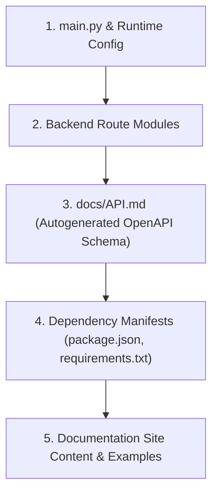

# Source of Truth Precedence

This page outlines the precedence chain of technical truth across the Marvox codebase, schemas, and documentation. If there is a mismatch between what the docs state and what the code executes, the code is always the absolute source of truth.

---

## The Precedence Chain

When resolving mismatches, verify technical details in this specific order of authority:

### 1. `main.py` & `backend/runtime_config.py`
- Sets prefix mounts for all API routing groups (e.g. `/api/characteros`, `/api/audio`).
- Asserts mandatory environment variables required to successfully boot in production.
- Controls Sentry backend, SRE hooks, and Schedulers.

### 2. Backend Route Files (`backend/*_routes.py`)
- Standard FastAPI endpoint paths, query parameters, and method declarations.
- Direct Pydantic models for all Request and Response validation (e.g. `SceneGenerationRequest`, `AudioGenerationRequest`).

### 3. Generated OpenAPI Spec (`docs/API.md`)
- The autogenerated spec exported from the live OpenAPI JSON payload during release-gate audits.

### 4. Dependency Manifests (`package.json` / `requirements-runtime.txt`)
- Version lockups for Next.js, FastAPI, OpenAI, pgvector, and downstream audio rendering components.

### 5. Documentation Site Content & Code Examples (`marvox-docs`)
- Guides, roadmap, explanations, and visual code snippets. Should be periodically audited to align strictly with layers 1-4.

---

## Active Gating & Verifications

The documentation site enforces strict checks during every build run:
1. **Type Checking & Linting**: Build will fail on any ESLint or TypeScript compile warnings.
2. **Stale Terms Scan**: A custom verification script (`scripts/check-stale-docs.sh`) parses all active markdown files and components. It will block the build if any deprecated parameters (such as the legacy audio endpoint or older vector store configurations) are discovered.
